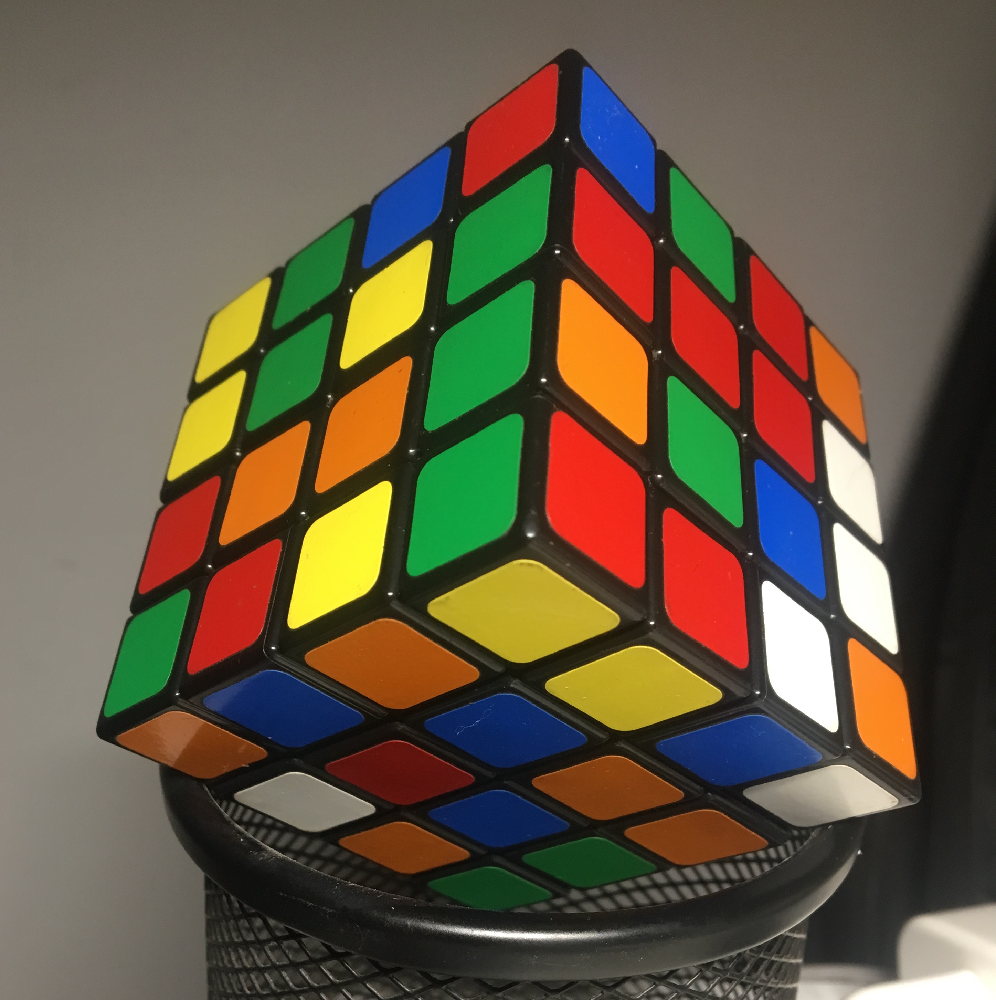
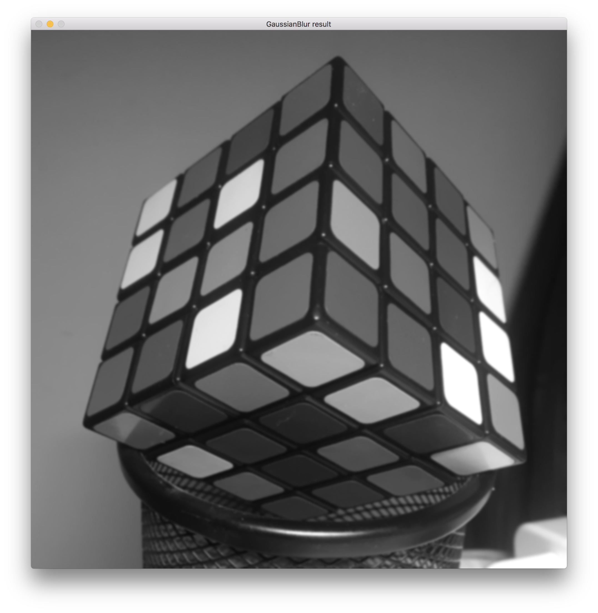
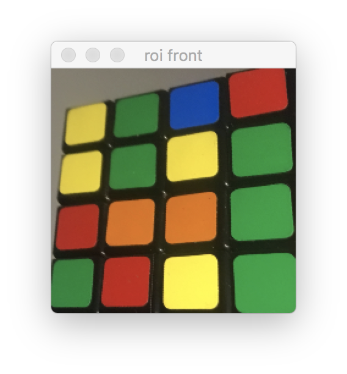
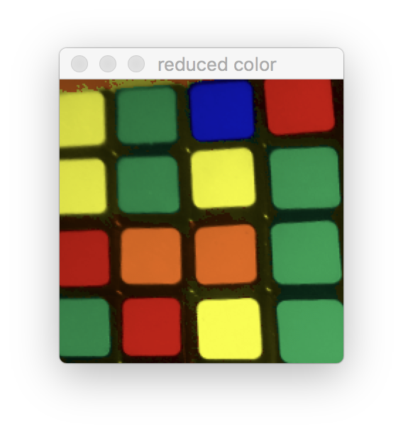
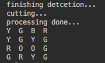

# Use opencv and Raspberry Pi 3 to solve Rubik's Cube
I'm still working on this project _(:з」∠)_ and **the pictures below haven't been updated yet** (其实是当时手边没有合适的三阶魔方，只好拿四阶来做实验，然后这个readme是当时写的，整体完成后忘记换图片了，悄悄用中文写，希望不会有人看到）

After I finish this competition, I'm going to put the pure vision part in another branch and use only two pictures to solve the cube.
## Introduction to this project
This is a small project for a vision and control competition, which use opencv and raspberry pi to do the vision part and add another pca9685 to control 6 servo to rotate the cube.The vision part use only two cameras to figure out the state of the cube. It can recognize three faces of a cube at a time.

## About the vision part
Because of the limited funds and the mechanical structure, I have to use two webcams to do the cube recognition. So I have to detect 3 faces of the cube at one time.

I use 3s video to get a stable result of recognition.For every frame, I use ***GaussianBlur()*** to get rid of the noise and use ***Canny()*** to detect the edges.

* GaussianBlur image

* Canny image

Next I use ***findCounters()*** and ***approxPolyDP()*** to get the square counters.For each square counter, I use the angle of its longest diagonal to define which face it belongs to. And there is also a trickey function in it.Because the cam and the cube are settled so I can use the stable postion of the squares in the unstable frame and get the most detaild square counter data.

* Squares image

For each face, there is a key sticker, which belongs to three faces of the corner block.I use the postion data of every stickers to define where the corner bolck is.After I find the key block.I can use the data of it to map the whole cube and find the bound of each face.I use ***warpPerspective()*** to flatten mapping and get the imagess for three faces.

* key block

* cube bound

* roi image

* remapped image

After that, I write a simple color reduce funtion just for this program. I turn the image into the HSV color space and use its Hue value and the Saturation value to define the color of each sticker. These color data are stored in a sticker array and will be combined to get all the color position in a string.So that I can use the two phase algorithm to solve the cube.

* color reduction

* recognize result

## About the algorithm to solve the cube
I use a kociemba binary file from https://github.com/muodov/kociemba

Example：DRLUUBFBRBLURRLRUBLRDDFDLFUFUFFDBRDUBRUFLLFDDBFLUBLRBD
Example output: D2 R' D' F2 B D R2 D2 R' F2 D' F2 U' B2 L2 U2 D R2 U

## About the cube
the cube looks like this

                 |************|
                 |*U1**U2**U3*|
                 |************|
                 |*U4**U5**U6*|
                 |************|
                 |*U7**U8**U9*|
                 |************|
    |************|************|************|************|
    |*L1**L2**L3*|*F1**F2**F3*|*R1**R2**R3*|*B1**B2**B3*|
    |************|************|************|************|
    |*L4**L5**L6*|*F4**F5**F6*|*R4**R5**R6*|*B4**B5**B6*|
    |************|************|************|************|
    |*L7**L8**L9*|*F7**F8**F9*|*R7**R8**R9*|*B7**B8**B9*|
    |************|************|************|************|
                 |************|
                 |*D1**D2**D3*|
                 |************|
                 |*D4**D5**D6*|
                 |************|
                 |*D7**D8**D9*|
                 |************|

 and the input order is:
 
 U1, U2, U3, U4, U5, U6, U7, U8, U9,
 U refered to servo 1
 
 R1, R2, R3, R4, R5, R6, R7, R8, R9,
 R refered to servo 2
 
 F1, F2, F3, F4, F5, F6, F7, F8, F9,
 F refered to servo 3
 
 D1, D2, D3, D4, D5, D6, D7, D8, D9,
 D refered to servo 4
 
 L1, L2, L3, L4, L5, L6, L7, L8, L9,
 L refered to servo 5
 
 B1, B2, B3, B4, B5, B6, B7, B8, B9.
 B refered to servo 6
 

 Solution string consists of space-separated parts, each of them represents a single move:

 A single letter by itself means to turn that face clockwise 90 degrees.
 
 A letter followed by an apostrophe means to turn that face counterclockwise 90 degrees.
 
 A letter with the number 2 after it means to turn that face 180 degrees.
 
 e.g. R U R’ U R U2 R’ U

 ## References
 https://stacks.stanford.edu/file/druid:yj296hj2790/Ng_Rubiks%20Cube_Reconstruction_from_Images.pdf

 https://stacks.stanford.edu/file/druid:yj296hj2790/Ng_Rubiks%20Cube_Reconstruction_from_Images.pdf

 https://www.researchgate.net/publication/234829781_Rubik's_cube_reconstruction_from_single_view_for_Service_robots

 http://www.wolfram.com/broadcast/video.php?c=97&v=43
